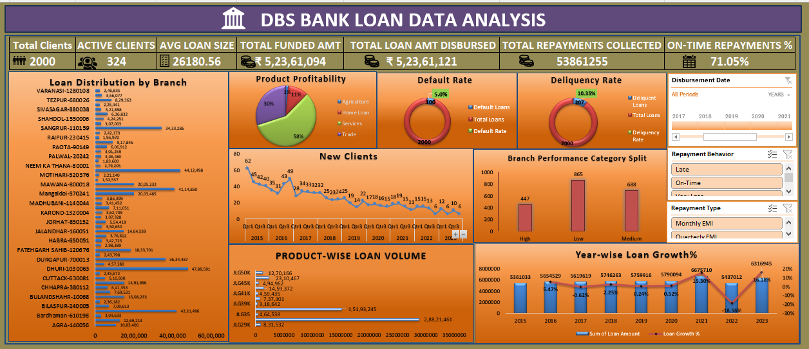
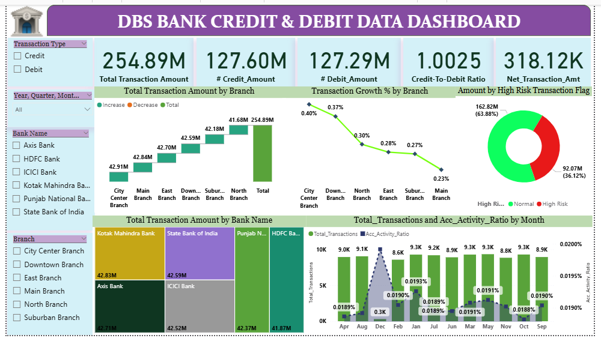

# 🏦 DBS Bank Loan & Transaction Analysis | End-to-End Data Analyst Project


---

# 📌 Project Overview

This project analyzes **DBS Bank financial data** to understand **loan distribution, client activity, and transaction behavior**.

The analysis transforms raw banking data into **actionable business insights** using SQL queries, Excel dashboards, Power BI reports, and Tableau visualizations.

The project includes two major analyses:

1. **Loan Data Analysis**
2. **Credit & Debit Transaction Analysis**

This project demonstrates a complete **end-to-end data analysis workflow** including:

- Data extraction
- Data cleaning
- Data visualization
- Business insight generation

---
# 📥 Data Source

The dataset used in this project was provided as part of a **data analysis project during the ExcelR / AI Variant internship**.

The dataset simulates real-world **banking operations**, including:

- Loan disbursement data
- Client activity information
- Credit and debit transactions across multiple branches and banks

This dataset was used to perform **exploratory data analysis, SQL querying, and dashboard development** using Excel, Power BI, and Tableau.

Note: The dataset is used strictly for **educational and portfolio purposes** and does not represent actual DBS Bank customer data.
 
 ---
 # 📊 Dataset Information

The dataset used in this project contains banking financial data related to **loan disbursements and customer transactions**.

### Loan Dataset

- Total Records: ~2000 clients
- Features include:
  - Client ID
  - Branch Name
  - Loan Amount
  - Funded Amount
  - Loan Category
  - Disbursement Date
  - Repayment Status
  - Risk Category
---

**Dataset Size**

Loan Dataset
• ~2000 client records
• 10+ features including branch, loan amount, risk category, disbursement date

Transaction Dataset
• Multiple bank transaction records
• Includes credit, debit, branch, bank, risk category
---
# ❓ Business Questions Answered

This analysis aims to answer key business questions related to banking operations and customer transactions.

### Loan Data Analysis

1. How many total clients does the bank have and how many are active?
2. What is the total loan amount disbursed by the bank?
3. Which branches contribute the highest loan disbursement?
4. What is the average loan size given to customers?
5. How has loan disbursement grown over the years?
6. What percentage of loans are repaid on time?
7. Which loan categories represent higher risk?

### Credit & Debit Transaction Analysis

1. What is the total transaction volume across banks?
2. How do credit and debit transactions compare?
3. Which banks generate the highest transaction amounts?
4. Which branches show the highest transaction growth?
5. What is the ratio of credit to debit transactions?
6. What proportion of transactions fall under high-risk categories?

---

# 🛠 Tools & Technologies Used

- **SQL** – Data extraction and analysis  
- **Excel** – Data cleaning and dashboard creation  
- **Power BI** – Interactive dashboards and KPI tracking  
- **Tableau** – Data visualization and analytics dashboards  

---
# Data Cleaning & Preparation

• Removed duplicate client records
• Handled missing values
• Converted date columns into proper format
• Standardized loan amount units
• Verified data accuracy using SQL queries

# 📊 Project 1: Loan Data Analysis

## 🎯 Objective

The objective of this analysis is to:

- Analyze **loan disbursement trends**
- Identify **active clients**
- Evaluate **repayment behavior**
- Compare **branch performance**
- Track **loan growth over time**

---

## 📈 Key KPIs

| Metric | Value |
|------|------|
| Total Clients | 2000 |
| Active Clients | 324 |
| Average Loan Size | ₹26,180 |
| Total Funded Amount | ₹5.23 Cr |
| Total Loan Disbursed | ₹5.23 Cr |
| Total Repayments Collected | ₹5.38 Cr |
| On-Time Repayment Rate | 71% |

---
Example SQL Query

```SELECT branch_name,
SUM(loan_amount) AS total_loan
FROM loan_data
GROUP BY branch_name
ORDER BY total_loan DESC;```

---
## 📷 Loan Dashboard Preview




---

## 🔍 Key Insights

- Loan distribution varies across different branches.
- Some branches contribute significantly to **total loan disbursement**.
- Loan growth increased significantly in **2021**.
- The **71% on-time repayment rate** indicates strong repayment behavior.
- Majority of loans fall into **medium and low risk categories**.

---

# 💳 Project 2: Credit & Debit Transaction Analysis

## 🎯 Objective

This analysis focuses on understanding **customer transaction behavior** across banks and branches.

The main goals are:

- Compare **credit vs debit transactions**
- Identify **high transaction branches**
- Monitor **transaction growth trends**
- Detect **high risk transactions**

---

## 📈 Key KPIs

| Metric | Value |
|------|------|
| Total Transaction Amount | 254.89M |
| Total Credit Amount | 127.60M |
| Total Debit Amount | 127.29M |
| Credit to Debit Ratio | 1.0025 |
| Net Transaction Amount | 318.12K |

---

## 📷 Credit & Debit Dashboard Preview



---

## 🔍 Key Insights

- Credit and debit transactions are **almost equal**, showing balanced financial activity.
- Some branches show **higher transaction growth**, indicating stronger banking engagement.
- Most transactions fall under **normal risk**, while a small portion are classified as high risk.
- Certain banks contribute significantly to the **overall transaction volume**.

---

# 💡 Skills Demonstrated

- SQL Data Analysis  
- Data Cleaning & Transformation  
- Excel Dashboard Development  
- Power BI Data Visualization  
- Tableau Visualization  
- KPI Analysis  
- Business Insight Generation  

---
# 🚀 Business Value

This project demonstrates how banking data can help organizations:

- Monitor **loan performance**
- Analyze **customer transaction behavior**
- Identify **branch performance**
- Detect **risk patterns**
- Support **data-driven financial decisions**

---
# 👩‍💻 Author

**Saba Attar**

Aspiring **Data Analyst** skilled in:

- SQL  
- Excel  
- Power BI  
- Tableau  
- Data Visualization
